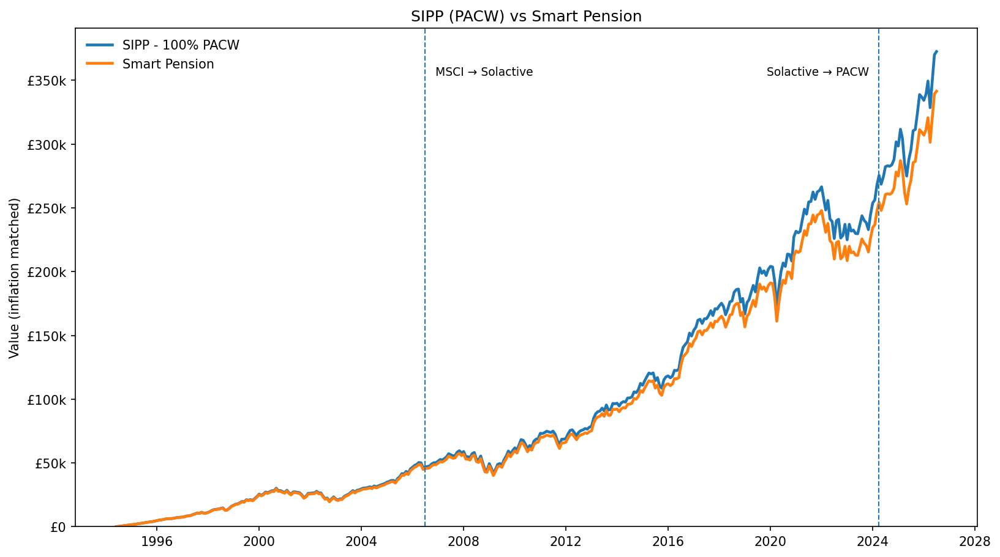

# SIPP vs Smart Pension

This project compares the long term value of a self invested personal pension invested in PACW with Smart Pension.

Both approaches use the same global equity return history, so the comparison focuses on the charges applied to each pension rather than differences in asset allocation.



## Result

| Approach | Ending value |
| --- | ---: |
| SIPP (PACW) | £372,512 |
| Smart Pension | £341,463 |
| **Difference** | **£31,049** |

The values are inflation matched and cover 31 May 1994 to 30 June 2026.

## Contributions used

| Age | Salary | Monthly contribution |
| --- | ---: | ---: |
| 26–29 | £33,400 | £223 |
| 30–39 | £42,899 | £286 |
| 40–49 | £47,313 | £315 |
| 50–58 | £45,608 | £304 |

The model uses a total pension contribution of 8% of salary.

## Return history

The monthly return history is built from:

1. MSCI ACWI GBP Net Return
2. Solactive GBS Global Markets Large & Mid Cap GBP NTR
3. Actual PACW returns

The dashed lines in the chart show where the source changes. Inflation adjustment uses ONS CPI.

## Files

- `SIPP_vs_Smart_Pension.ipynb` — Jupyter notebook
- `SIPP_vs_Smart_Pension.html` — browser version
- `PACW_History_1994_2026.xlsx` — historical data and source tabs
- `pension_comparison.png` — main chart
- `requirements.txt` — Python packages for pip
- `environment.yml` — Conda/Anaconda environment

## Running the project in Anaconda

```bash
conda env create -f environment.yml
conda activate pension-comparison
jupyter lab
```

Open `SIPP_vs_Smart_Pension.ipynb` and run the notebook from top to bottom.

## Main sources

- MSCI ACWI GBP Net Return: https://www.msci.com/documents/10199/255599/msci-acwi-index-gbp-net.pdf
- MSCI historical data distribution: https://curvo.eu/backtest/en/market-index/msci-acwi?currency=gbp
- Solactive index: https://www.solactive.com/index/DE000SL0BAK1/
- PACW: https://www.amundietf.co.uk/en/professional/products/equity/amundi-prime-all-country-world-ucits-etf-acc/ie0003xja0j9
- ONS CPI: https://www.ons.gov.uk/economy/inflationandpriceindices/timeseries/d7bt/mm23
- ONS earnings data: https://www.ons.gov.uk/employmentandlabourmarket/peopleinwork/earningsandworkinghours/datasets/agegroupashetable6
- Smart Pension charges: https://www.smartpension.co.uk/support/en/articles/12256545-your-2025-annual-pension-statement

The spreadsheet contains the fuller source list used in the model.

## Limitations

The comparison uses the same investment returns for both pensions. It does not reconstruct Smart Pension's actual historical asset allocation. Historical index data is used before PACW's live history, so the result should be read as a historical model rather than a record of what either pension would literally have returned in every year.
